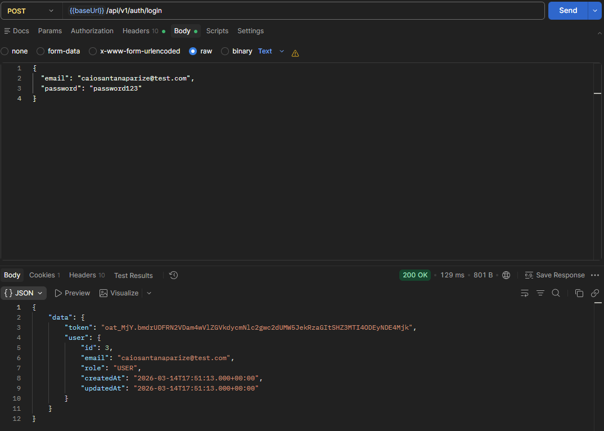
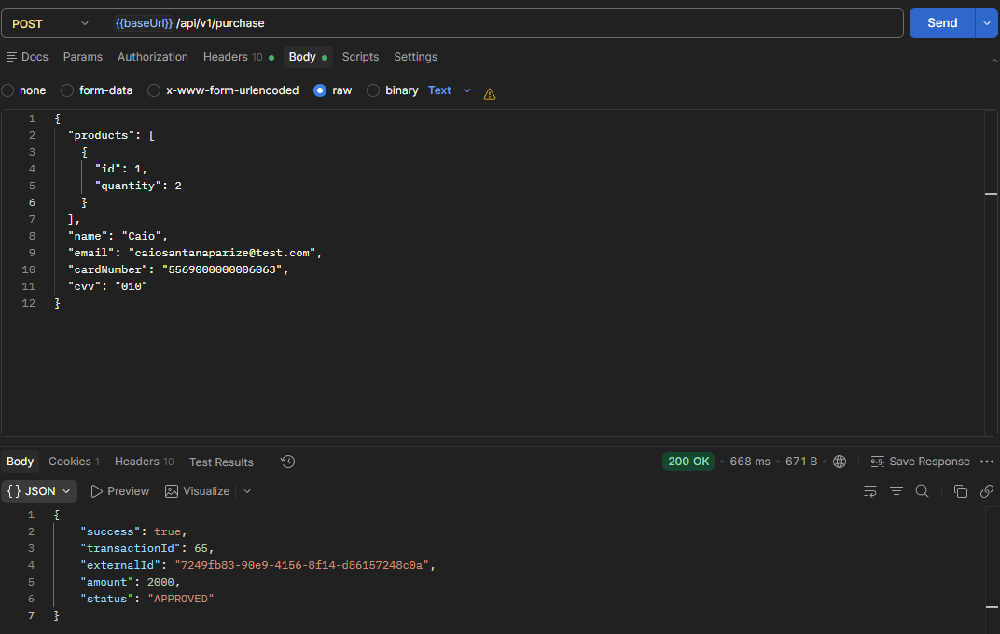
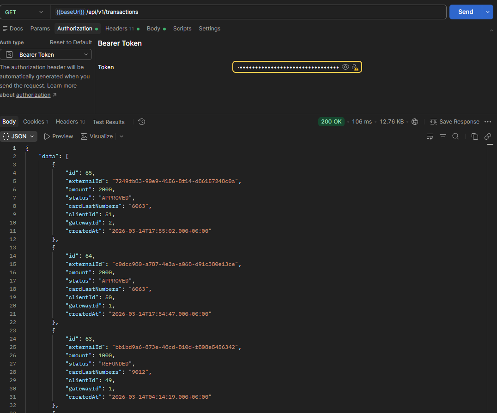
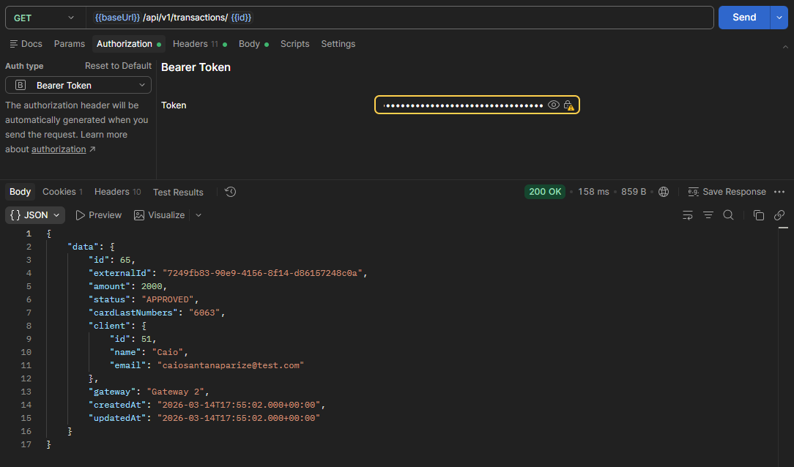
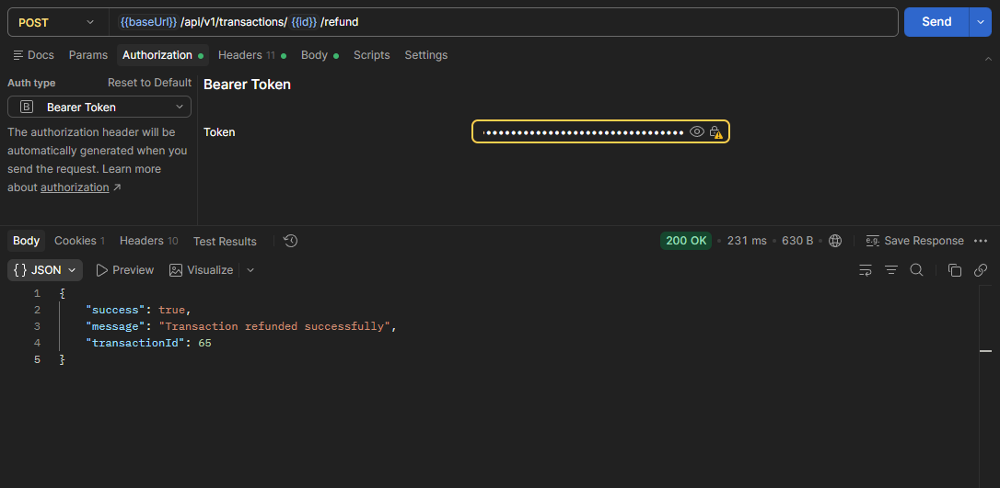

# API Gerenciador de Pagamentos

API REST em Node.js (AdonisJS) para gerenciamentos de pagamentos com múltiplos gateways, fallback automático e autenticação JWT.

---

## Features

- Multi-gateway com fallback automático;
- Gateway 1 e Gateway 2 integrados;
- Valor calculado a partir de produtos e quantidades;
- Autenticação JWT;
- Validação de dados com VineJS;
- ORM Lucid com MySQL;
- Testes automatizados;
- Documentação interativa com Swagger/OpenAPI;
- Collection em .json para Postman;
- Docker Compose para desenvolvimento;

---

## Instalação

```bash
# 1. Instalar dependências
npm install

# 2. Configurar env
cp .env.example .env

# 3. Compilar TypeScript
npm run build

# 4. Iniciar com Docker
docker-compose up -d
```

---

## Comandos

```bash
npm start             # Inicia o servidor (produção)
npm run dev           # Modo desenvolvimento
npm run build         # Compila TypeScript
npm run test          # Executa testes
npm run lint          # Verifica código
npm run format        # Formata código
```

---

## Autenticação

A API utiliza autenticação JWT.

**Headers**

| Header          | Valor                        |
|-----------------|------------------------------|
| Content-Type    | application/json             |
| Authorization   | Bearer `<token>`             |

**Login**

```bash
curl -X POST http://localhost:3333/api/v1/auth/login \
  -H "Content-Type: application/json" \
  -d '{
    "email": "seu@email.com",
    "password": "sua_senha"
  }'
```

**Resposta**

```json
{
  "data": {
    "token": "eyJhbGciOiJIUzI1NiIs...",
    "user": {
      "id": 1,
      "email": "seu@email.com",
      "role": "USER"
    }
  }
}
```

---

## Endpoints

### `POST /api/v1/purchase`

Realiza uma compra com fallback automático entre gateways.

**Body**

```json
{
  "products": [
    { "id": 1, "quantity": 2 }
  ],
  "name": "João Silva",
  "email": "joao@exemplo.com",
  "cardNumber": "4532123456789012",
  "cvv": "123"
}
```

**Resposta**

```json
{
  "success": true,
  "transactionId": 1,
  "externalId": "abc123-def456",
  "amount": 2000,
  "status": "APPROVED"
}
```

---

### `POST /api/v1/auth/signup`

Cria um novo usuário.

**Body**

```json
{
  "email": "novo@email.com",
  "password": "senha123",
  "passwordConfirmation": "senha123",
  "name": "Novo Usuário"
}
```

---

### `GET /api/v1/gateways`

Lista todos os gateways (requer autenticação).

**Resposta**

```json
{
  "data": [
    {
      "id": 1,
      "name": "Gateway 1",
      "isActive": true,
      "priority": 1
    },
    {
      "id": 2,
      "name": "Gateway 2",
      "isActive": true,
      "priority": 2
    }
  ]
}
```

---

### `PATCH /api/v1/gateways/:id`

Atualiza gateway (ativar/desativar, alterar prioridade).

**Body**

```json
{
  "isActive": false,
  "priority": 1
}
```

---

### `GET /api/v1/clients`

Lista todos os clientes (requer autenticação).

---

### `GET /api/v1/clients/:id`

Mostra detalhes de um cliente com suas compras.

---

### `GET /api/v1/transactions`

Lista todas as transações (requer autenticação).

---

### `GET /api/v1/transactions/:id`

Mostra detalhes de uma transação.

---

### `POST /api/v1/transactions/:id/refund`

Realiza estorno de uma transação (requer autenticação).

---

## Exemplos com cURL

**Login**

```bash
curl -X POST http://localhost:3333/api/v1/auth/login \
  -H "Content-Type: application/json" \
  -d '{
    "email": "admin@test.com",
    "password": "password123"
  }'
```

**Compra**

```bash
curl -X POST http://localhost:3333/api/v1/purchase \
  -H "Content-Type: application/json" \
  -d '{
    "products": [{"id": 1, "quantity": 2}],
    "name": "João Silva",
    "email": "joao@exemplo.com",
    "cardNumber": "4532123456789012",
    "cvv": "123"
  }'
```

**Listar transações (com token)**

```bash
TOKEN="seu_token_aqui"

curl -X GET http://localhost:3333/api/v1/transactions \
  -H "Authorization: Bearer $TOKEN"
```

---

## Postman Collection

A collection está disponível em: [postman/collection.json](postman/collection.json)

---

## Exemplos no Postman

### Login



### Compra



### Listar Transações



### Detalhes da Transação



### Estorno



---

---

## Tecnologias

- **TypeScript** — linguagem principal
- **Node.js** — runtime
- **AdonisJS 7** — framework HTTP
- **VineJS** — validação de dados
- **Lucid** — ORM
- **MySQL** — banco de dados
- **JWT** — autenticação
- **Japa** — testes
- **ESLint** — linting

---

## Testes

```bash
# Todos os testes
npm run test

# Com Docker
docker-compose exec app node ace test
```

---

## Documentação Interativa (Swagger)

A API possui documentação interativa via Swagger UI:

- **Swagger UI**: http://localhost:3333/docs
- **OpenAPI JSON**: http://localhost:3333/docs/openapi.json

---

## Arquitetura

```
app/
├── controllers/          # Controladores da API
├── exceptions/          # Tratamento de erros
├── middleware/          # Middlewares (auth, etc)
├── models/              # Modelos do banco (Lucid)
├── services/            # Lógica de negócio
│   └── gateway/        # Integração com gateways
├── validators/          # Validação de dados (VineJS)
├── transformers/        # Transformação de dados
└── providers/          # Providers do AdonisJS

config/                  # Configurações da aplicação
database/
├── migrations/          # Migrações do banco
└── seeders/             # Seeders para dados iniciais
start/                   # Configurações de inicialização
tests/
├── functional/          # Testes funcionais
└── unit/               # Testes unitários
```

---

## Docker Compose

O projeto inclui Docker Compose com:

- **MySQL** — banco de dados
- **Gateways Mock** — simulação dos gateways de pagamento
- **App** — aplicação AdonisJS

```bash
# Iniciar todos os serviços
docker-compose up -d

# Ver logs
docker-compose logs -f

# Parar serviços
docker-compose down
```

---

## Produtos Cadastrados

Os seguintes produtos são seeded automaticamente:

| ID | Nome       | Valor (centavos) |
|----|------------|-------------------|
| 1  | Produto A  | 1000              |
| 2  | Produto B  | 2500              |
| 3  | Produto C  | 500               |

---

## Camada de Gateway

A arquitetura utiliza o padrão **Strategy** para facilitar a adição de novos gateways:

1. Criar nova classe que estende `BaseGateway`
2. Implementar `processPayment()` e `processRefund()`
3. Adicionar ao `GatewayManager`

O sistema automaticamente:
- Lista gateways ativos ordenados por prioridade
- Tenta payment no primeiro gateway
- Se falhar, tenta o próximo
- Retorna sucesso se qualquer gateway processar
